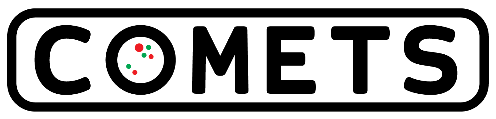

# Computation of Microbial Ecosystems in Time and Space 
COMETS is a software platform for performing computer simulations of spatially structured microbial communities. It is based on stoichiometric modeling of the genome-scale metabolic network of individual microbial species using dynamic flux balance analysis, and on a discrete approximation of diffusion. COMETS is built and maintained by the [Daniel Segre Lab](www.bu.edu/segrelab) at Boston University.

COMETS is distributed in the hope that it will be useful, but WITHOUT ANY WARRANTY; without even the implied warranty of MERCHANTABILITY or FITNESS FOR A PARTICULAR PURPOSE. See the GNU General Public License for more details. 

Comets is developed with non-commercial use in mind and is presented as-is. To inquire about collaborations or commercial usage and development, please contact us at <comets@bu,edu>.
    
# Documentation
Documentation on how to install and use COMETS is found at [comets-manual.readthedocs.io](https://comets-manual.readthedocs.io/en/latest/).

# Installation
COMETS can be downloaded from [www.bu.edu/segrelab/comets/](http://www.bu.edu/segrelab/comets/)

# Toolboxes
We have developed both a Matlab and a python toolbox to interface the Comets software. How to use these toolboxes are described in the [documentation](https://comets-manual.readthedocs.io/en/latest/).
 - Matlab toolbox: [github.com/segrelab/comets-toolbox](https://github.com/segrelab/comets-toolbox)
 - Python toolbox: [github.com/djbajic/COMETS-Python-Toolbox](https://github.com/djbajic/COMETS-Python-Toolbox)

# Cite us
If you use COMETS in you scientific work, please cite:
>Harcombe, W. R., Riehl, W. J., Dukovski, I., Granger, B. R., Betts, A., Lang, A. H., Bonilla, G., Kar, A., Mehta, M., Marx, C. J. & Segré, D (2014). Metabolic resource allocation in individual microbes determines ecosystem interactions and spatial dynamics. Cell reports, 7(4), 1104-1115.

# Contributing
Contributions are welcome and appreciated. Questions and discussions can be raised on [Gitter](https://gitter.im/segrelab/comets). Issues should be discussed in this forum before they are raised on GitHub. For other questions contact us on email comets@bu.edu.
